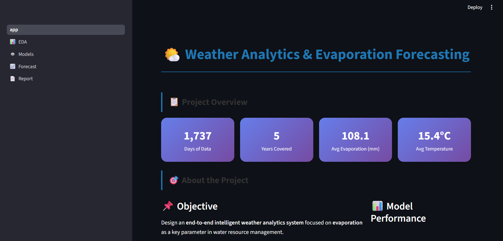
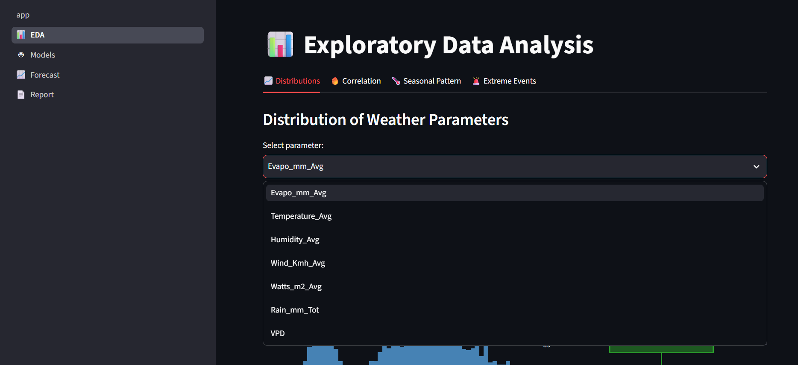
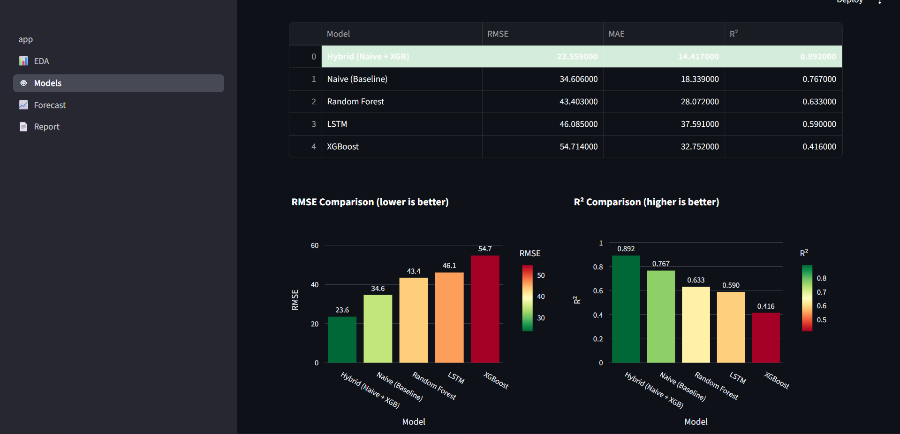
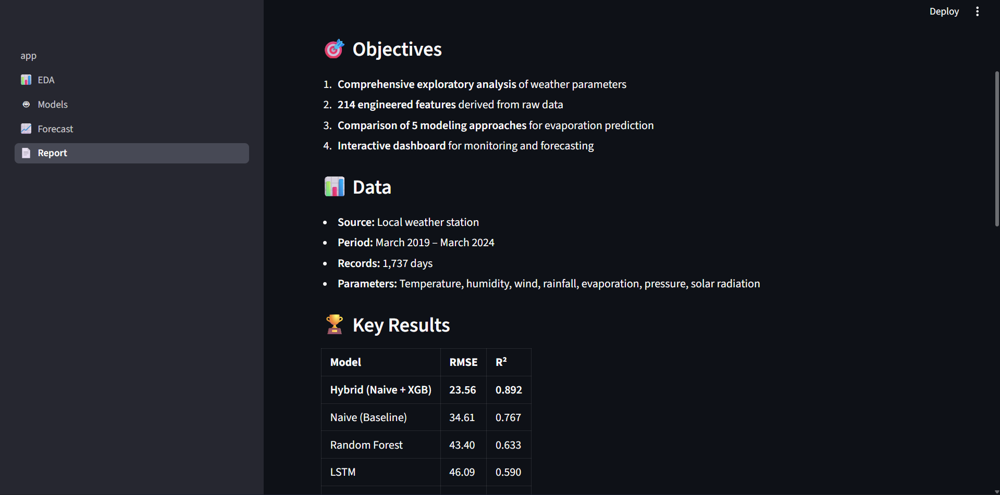

# 🌤️ Weather Analytics & Evaporation Forecasting

> An end-to-end Machine Learning project for daily evaporation forecasting using 5 years of real meteorological data.


---

##   Project Overview

This project designs an **intelligent weather analytics system** focused on **evaporation forecasting** as a key parameter in water resource management.

###   Objectives

- Comprehensive **Exploratory Data Analysis (EDA)** of weather parameters
- **214 engineered features** derived from raw data
- Comparison of **5 modeling approaches**: Naive, Random Forest, XGBoost, Hybrid, LSTM
- **Interactive Streamlit dashboard** for real-time monitoring and forecasting

---

##   Key Results

| Model                    | RMSE      | MAE       | R²        |
| ------------------------ | --------- | --------- | --------- |
| **Hybrid (Naive + XGB)** | **23.56** | **14.42** | **0.892** |
| Naive (Baseline)         | 34.61     | 18.34     | 0.767     |
| Random Forest            | 43.40     | 28.07     | 0.633     |
| LSTM                     | 46.09     | 37.59     | 0.590     |
| XGBoost                  | 54.71     | 32.75     | 0.416     |

  The Hybrid model achieved a 32% improvement over the baseline.**

---

##   Key Findings

1. **Strong autocorrelation of evaporation** (r ≈ 0.95) — Naive baseline is powerful
2. **Hybrid Model** combining simplicity with ML power gives the best results
3. **Pure ML models** overfit in time series with high autocorrelation
4. **Humidity** is the strongest inhibitor of evaporation (r = -0.68)

---

##   Dashboard Screenshots

### Home Page


### EDA — Correlation Analysis


### Model Comparison


### Live Forecast


---

##   Quick Start

### 1. Clone the repository

```bash
git clone https://github.com/your-username/weather-ml-dashboard.git
cd weather-ml-dashboard
